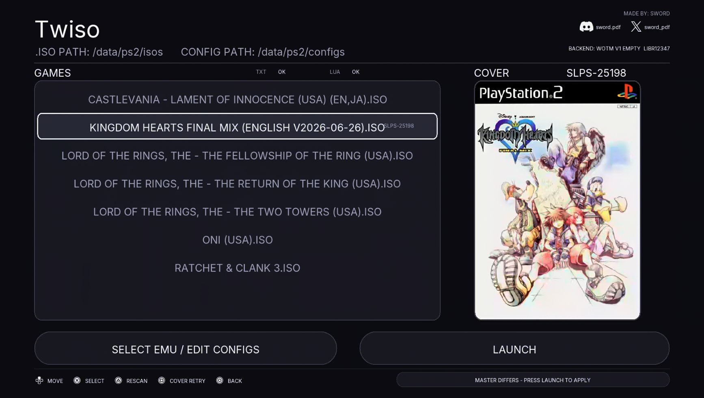

# Twiso — PS2 ISO Launcher

A **native PlayStation 5 homebrew front-end** that browses your PS2 ISOs and boots
them through selectable PS2 emulator packages — all from a clean, PS5-styled UI.

> Status: **work in progress / experimental homebrew.** Not affiliated with or
> endorsed by Sony. Requires a jailbroken console (see [Requirements](#requirements)).

> **This repository ships no emulator runtimes and no packaged backends.**
> It contains only the front-end, its build tooling, and documentation. You
> must supply your own emulator packages (see
> [Bring your own backends](#bring-your-own-backends)).



## What it does

- Scans `/data/PS2/isos` and lists your games; the list **scrolls** and long
  names wrap to fit.
- Reads each game's **disc serial** automatically as you highlight it
  (read-only ISO scan) — used to key its config and artwork.
- **Per-game configs**, keyed by PS2 serial: `/data/PS2/configs/<SERIAL>.txt`
  (emulator CLI) and `<SERIAL>.lua`. Defaults are created on demand.
- **Cover art** from [`xlenore/ps2-covers`](https://github.com/xlenore/ps2-covers):
  downloaded over HTTPS and decoded **on-console** by a bundled baseline +
  progressive JPEG decoder straight into the framebuffer.
- **Selectable backend**: launches one of the installed emulator packages
  (e.g. WotM v1/v2, JAK2 v2, RECVX, Red Faction, KOF2000) by title ID.
- **PS5-styled UI**: rounded panels, real DualSense button prompts, a
  PS5-style loading bar, an in-app settings screen, and a large cover pane.
- Diagnostics: on-screen status, a klog capture script, and a
  `/data/PS2/cover-debug.log` trace.

## Requirements

**Console (runtime)**

- A **jailbroken PS5** on an exploitable firmware, with an ELF loader.
- **etaHEN** (or **OnionHEN**) app-jailbreak daemon. The app runs as
  `PPSA99202`, which must be whitelisted in the HEN's jailbreak daemon via
  `[app_jailbreak] exact_title_ids` — otherwise its backend-launch request
  is ignored.
- [ps-patch-system](https://github.com/illusionyy/ps-patch-system) by
  **illusionyy** (Apache-2.0) — patch shellcore to mount `/data` in the
  sandbox so the app and the emulator backends can read it.
- **ShadowMount** by **drakmor** — mounts `/data/homebrew/PPSA99202-app` at
  `/user/app/PPSA99202/mount.lnk` so Twiso shows up on the PS5 home screen.
- **Your own emulator backend packages** installed (see below).
- Optional: network access for cover downloads.

**Build (host)**

- WSL2 / Linux with **Clang/LLD 18**, `python3`, `bash`.
- [PS5 payload SDK](https://github.com/ps5-payload-dev/sdk) **v0.42** and
  zlib **1.3.2** (fetched/verified by the tooling).

## Bring your own backends

The front-end launches a **PS4-title emulator package by its installed title
ID**; it neither ships nor swaps the emulator binary. Those packages are **not
included**. The registry maps each menu entry to a title ID:

| Menu label | Installed title ID |
| --- | --- |
| WOTM V1 EMPTY | `LIBR12347` |
| JAK2 V2 EMPTY | `LIBR12348` |
| RECVX EMPTY | `LIBR12349` |
| RED FACTION EMPTY | `LIBR12350` |
| KOF2000 EMPTY | `LIBR12351` |
| WOTM V2 EMPTY | `LIBR12352` |

You have two options.

**A. Build your packages under the expected IDs.** Package your own emulator
runtime (one you have the right to use) as an external-config launcher and
install it under a matching title ID (`LIBR12347`–`LIBR12352`). The tested
recipe is:

- **Title ID** = one of the IDs above (this also sets the content ID,
  `UP9000-<ID>_00-…`).
- **`config-emu-ps4.txt`** = exactly one line, nothing else:
  ```text
  --config="/data/PS2/configs/master.txt"
  ```
- **`image/disc01.iso`** = a 0-byte placeholder; the real ISO is supplied by
  `master.txt` at runtime.
- Optional art: `sce_sys/icon0.png` 512×512 and `sce_sys/pic1.png` 1920×1080.

Then install it. The package **filename does not matter** (it's only shown in
the UI) — only the **installed title ID** matters.

**B. Use your own IDs.** Edit `kBackends` in
`PS2-Library-Prototype/diagnostics/native-launch-probe-12-fixed/src/main.cpp`
(label, title ID, artifact string) and rebuild with `build.sh`. Any installed
package with that title ID will then launch from the matching menu row.

> Never redistribute emulator runtimes, Sony code, or game data. That is on you.

## Install (console)

**0. Whitelist `PPSA99202` in etaHEN's jailbreak daemon**

Twiso must be whitelisted in the HEN's jailbreak daemon to get the
privileges needed to launch a backend. Add its title ID to your HEN's
app-jailbreak list and reload the HEN — without this, etaHEN ignores the
app's jailbreak request and backend launch fails:

- **etaHEN** — `/data/etaHEN/config.ini`:
  ```ini
  [app_jailbreak]
  exact_title_ids=PPSA99202
  ```
- **OnionHEN** — `/data/OnionHEN/config.ini`:
  ```ini
  [app_jailbreak]
  # comma-separated, max 20; keep your existing IDs too
  exact_title_ids=PPSA99202
  title_id_prefixes=LAPY
  ```
  (or add it in the OnionHEN **Toolbox → App jailbreak** list)

At launch the app publishes a request at `/download0/etahen_jailbreak`
(`{"PID":<pid>}`); both etaHEN and OnionHEN consume it, but only if
`PPSA99202` is whitelisted above.

Also, with [ps-patch-system](https://github.com/illusionyy/ps-patch-system)
running (send `patch-bundle-loader-prospero.elf` to the ELF loader on port
9021), open its web UI at `http://<console-ip>:23900` and apply the patch that
mounts `/data` in the sandbox. Without it, the app cannot read its ISOs,
configs, or covers.

**1. Put the app in place** (via **ShadowMount** by **drakmor**)

```text
/data/homebrew/PPSA99202-app/        # eboot.bin, sce_module/, sce_sys/, assets/
/user/app/PPSA99202/mount.lnk    ->  /data/homebrew/PPSA99202-app
```

**2. Create the data folders** — the app does **not** create directories, so
these must exist first:

```text
/data/PS2/isos/       # drop your *.iso files here (scanned by the menu)
/data/PS2/configs/    # per-game <SERIAL>.txt + <SERIAL>.lua live here
/data/PS2/covers/     # cover-art cache (auto-filled on demand)
```

Example, over FTP:

```text
MKD /data/PS2
MKD /data/PS2/isos
MKD /data/PS2/configs
MKD /data/PS2/covers
```

**3. Install your backend emulator packages** (see above).

**4. Use it**

1. Launch **Twiso**; it scans `/data/PS2/isos`.
2. Move to a game and press **X** — this reads its disc ID and
   creates/validates its per-game files (`<SERIAL>.txt` / `.lua`).
3. Open **SELECT EMU / EDIT CONFIGS** and **pick the installed backend** you
   want to run (and toggle any per-game options). The last row is **BACK**.
4. Focus **LAUNCH** and press **X**.

> The backend must actually be installed, or the launch request will fail — the
> app launches the selected title ID, it can't swap emulator binaries.

Full end-user notes (including the optional per-game saves note):
[`RELEASE-SETUP.md`](PS2-Library-Prototype/RELEASE-SETUP.md).

## First-run walkthrough

What you should see, and the on-screen text that tells you it's working:

1. **Boot.** Bottom status: `DISPLAY READY - CONTROLLER TEST STARTING` →
   `RELEASE ALL BUTTONS TO ENABLE INPUT` → `CONTROLLER READY`. It scans
   `/data/PS2/isos` (`STARTUP SCAN REQUESTED - READ ONLY`).
   - Empty list shows **`NO ISOs FOUND`** / `ADD .ISO FILES TO /DATA/PS2/ISOS`.

2. **Highlight a game.** The **COVER** header shows `SCANNING` briefly, then the
   disc serial (e.g. `SCUS-97353`). The pane shows `LOADING COVER` (with a
   shimmer) and then the artwork.
   - No local art triggers a download; if that fails you'll see
     `NO COVER ON DISK` and a `DOWNLOAD: …` reason. Press **Square** to retry.

3. **Press X on the game.** Bottom pill: `GAME ID CHECK REQUESTED - READ ONLY`
   → `GAME ID FOUND - FILES CHECK STARTED`.
   - If per-game files are missing you land on **`GAME FILES MISSING - PLACE OR
     CREATE`**: press **X** to `CREATE DEFAULTS` (writes `<SERIAL>.txt` + `.lua`),
     or FTP your own and press **Triangle** to recheck.
    - When it's ready the pill shows **`READY - PRESS LAUNCH`**. Seeing
      `MASTER DIFFERS - PRESS LAUNCH TO APPLY` on a new game is normal.
    - Fresh setup with no `master.txt` yet: the app cannot create it from
      nothing — seed `/data/PS2/configs/master.txt` over FTP first with any
      non-empty content (an empty file is rejected). Easiest is the loader
      for your game, e.g. for `SCUS-97481`:
      ```text
      # PS2 Library loader - SCUS-97481. Managed on every launch; edit the game files instead.
      --config="/data/PS2/configs/SCUS-97481.txt"
      --config-local-lua="/data/PS2/configs/SCUS-97481.lua"
      ```
      A single `#` line also works; LAUNCH then replaces it with the real
      loader automatically.

4. **Pick the backend.** Open **SELECT EMU / EDIT CONFIGS**; the row you choose
   is marked `ACTIVE` and the pill shows `BACKEND SELECTED`. Press **BACK**.

5. **Launch.** Focus **LAUNCH** and press **X**. A loading screen appears with
   the cover, a `CONFIGS RUNNING` note if options are enabled, and a progress
   bar (`TRANSACTION IN PROGRESS - DO NOT CLOSE THE APP`). The console then
   switches to the selected emulator package.

## Usage

- **D-pad Up/Down** move, **X** select, **Triangle** rescan ISOs,
  **Square** retry cover download, **Circle** back.
- **SELECT EMU / EDIT CONFIGS** opens the settings screen (emulator backend +
  per-game options). **Right** jumps to the launch button.
- Per-game files live in `/data/PS2/configs/`; `master.txt` is a generated
  loader that points the selected backend at the selected game's files.

## Building

```sh
# Frontend (WSL)
cd PS2-Library-Prototype/diagnostics/native-launch-probe-12-fixed
PS2_LIBRARY_SHARED_VMC=1 bash build.sh
```

- The build is pinned and verified (import gate, ELF layout, host tests).
- Font/icon/art atlases are generated offline by `gen_ui_font.py`,
  `gen_ui_icons.py` and the artwork scripts; outputs are checked in.
- Backend packages are **yours to build** (see
  [Bring your own backends](#bring-your-own-backends)).

## Project layout

```
PS2-Library-Prototype/
  diagnostics/native-launch-probe-12-fixed/   # front-end source + build + tests
  native/                                     # PS5 payload SDK bootstrap + runtime shim
  RELEASE-SETUP.md                            # end-user folder/setup notes
```

## Credits

See [`CREDITS.md`](CREDITS.md). Highlights: the
[PS5 payload SDK](https://github.com/ps5-payload-dev/sdk), **etaHEN** /
**OnionHEN**, [ps-patch-system](https://github.com/illusionyy/ps-patch-system)
by **illusionyy** (Apache-2.0),
`ps5-native-app-boilerplate` by **BlackBearReloaded**,
`ps2-covers` by **xlenore**, **Inter** by Rasmus Andersson, and
**PS5 Button Icons and Controls** by **Zacksly** (CC BY 3.0).

## License

Project-authored code: **GPL-3.0-or-later**. Bundled third-party assets keep
their own licenses (see [`CREDITS.md`](CREDITS.md)). No Sony code, emulator
runtime, or game data is distributed by this repository.

## Disclaimer

Homebrew software for personal use on your own console. Use at your own risk.
This project is not affiliated with Sony Interactive Entertainment. Do not
redistribute game ISOs, emulator runtimes, or proprietary assets.
